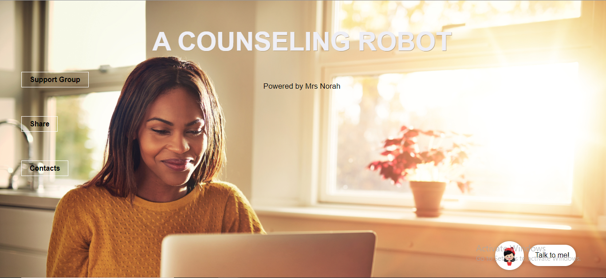
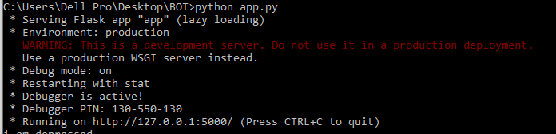

# VekuMeku-Robot
Artificial Intelligence Nam-Counselling Robot

The world thus far seen little AI applied as much as it is talked about at many conferences, It is in this age of a pandemic that people have realised the 
importance of E-learning and having it set up just right, and it is in this times that I realised that soo many people(/students) are suffering from mental illnesses and 
just need advice, counselling or just someone to listen. There just arent enough Therapists for everyone, and some people arent comfortable talking to people.

So to combact this challenge I set out to develop a counselling chatbot. This a challenge that Ive only thus far been able to create a prototype, that speaks(not in the most fluttering voice, but as baseline is acceptable), it doesnt listen to speech yet, But those arent that big of a deal. 

What should matter most is, Is a computer able to provide the some or atleast some therapeutic support to a troubled human being? Can a Computer understand and relate and advice?

In this prototype I attempt to create a brain, or atleast the mere logic of a sane person's mind using Natural Language Processing and many others resources I could find at my aid, Tensorflow trained models being the area of most interest, but simple import errors and a slow PC robbed me of that option.

I believe that this initiative and interest in AI and Counselling will spark a fire in people(e.i. students persuing IT), to not only look at technology as interfaces with databases, but possibly more dynamic and less static solutions.

### Prototype Video
For the prototype Video please follow this link https://youtu.be/rPzyUxIMFcU




````RUN
python app.py
````
Access chatbot locally here http://127.0.0.1:5000/

